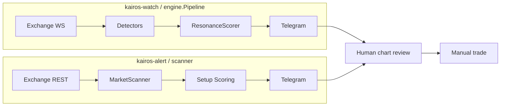

# Kairos 架构与策略审查（2026-07）

> 多视角审查结论 + 已落地优化 + 后续路线图。权威边界仍以 `architecture.md` / `trading-system.md` 为准。

## 1. 系统思维：两条运行时路径



**观察**

- **watch** 负责硬数据异常（价量/OI/资金费率/共振），毫秒~分钟级。
- **alert** 负责确定性结构扫描（1d/4h/15m），分钟~cron 级。
- 两路径**无共享状态**：WS 异常不会自动提升 scanner 候选优先级；scanner 也不回写 watch 的 dedup。

**杠杆点（按影响排序）**

| 优先级 | 杠杆点 | 理由 |
|--------|--------|------|
| P0 | Scanner 周期门禁与策略文档对齐 | 防止冬天仍推 long `trade_candidate` |
| P1 | 统一 `alertPolicy` 配置面 | config 里 `dataManager` 命名遗留，pipeline 实际读 `alertPolicy` |
| P2 | Scanner 候选发现效率 | `fetchTicker` 每次拉全量 tickers；deep analysis 串行 OHLCV |
| P3 | watch → alert 软链接 | 可选：WS 异常 symbol 写入本地 hint 文件，scanner 加权 |

## 2. 第一性原理：产品边界是否被代码违反？

**不变量（来自 architecture.md）**

1. 无 LLM、无下单、无账户权益 sizing。
2. `trade_candidate` = 阈值通过，不是交易指令。
3. 人类拥有最终决策权。

**代码符合项**

- `Execution.enabled: false` 固定；Telegram 文案含 human-control 线（notify 测试覆盖）。
- 风险输出仅为 `maxPositionPct` / `maxLeverage` 上限，非绝对 USDT 仓位。
- 双命令分离清晰，Graceful shutdown（pipeline errgroup + context）。

**偏离项（策略语义，非安全边界）**

- 策略文档「冬天 = 冬眠空仓」，但 scorer 仅提高 RR 阈值，仍可能输出 long `trade_candidate`。
- 策略强调「箱底承接 > 追突破」，实现仅建模 **4h 箱体上沿突破** 为 long trigger。
- 「龙头/次新/抗跌」无显式因子，candidate_score 主要是流动性 + 24h 动量。

## 3. 逆向思考：什么会让系统产生最大伤害？

| 失败模式 | 当前缓解 | 缺口 |
|----------|----------|------|
| Telegram 刷屏 | dedup + symbol cooldown + severity gate | cooldown 默认 30min，突发共振仍可能连发 |
| 流动性陷阱 alt | `minimumLiquidityQuoteVolume` | 无盘口深度/滑点代理 |
| 逆势 long（冬天） | cycle 降分 + strict RR | 未硬性降级 action_state |
| 假突破追多（秋天补涨） | autumn threshold 6.5 | BTC 非 up 时 long 仍可能 candidate |
| 配置漂移 | viper defaults | `CycleDetector` 阈值硬编码，未进 yaml |

## 4. 二阶效应：若继续加功能会怎样？

- **加 ML/LLM 评分** → 破坏可审计性，与产品边界冲突；应拒绝。
- **合并 watch+alert 为单进程** → 简化部署，但 cron 扫描与 7×24 WS 生命周期不同，需 supervisor 策略。
- **加承接入场模型** → 与现有 breakout trigger 并存，需新 action_state 或 sub-type，避免混淆「突破单」与「承接单」。
- **共享 sqlite hint 表** → 低耦合联通两路径，但引入存储运维；可先用 JSONL append-only。

## 5. 策略对齐矩阵

| 策略原则 (trading-system.md) | 代码现状 | 建议 |
|------------------------------|----------|------|
| 春夏秋冬因时施策 | `CycleDetector` + cycleThresholds | ✅ 已用；**已加** winter long / autumn 非共振降级 |
| 1d/4h/15m 三周期 | scanner timeframes | ✅ |
| 裸 K 箱体，不用指标 | BoxDetector + Trend | ✅ |
| 箱底承接 | 仅 high 突破 trigger | 📋 P1：增加 `near_low` + 双底拐点检测 |
| BTC 共振 | btcResonance 评分项 | 部分；缺「同步启动」时间窗 |
| 冬天冬眠 | strict RR only | **已修复**：long candidate 降级 prepare |
| 秋天防守 | weakCycle 减半仓位 | ✅；**已加** 非共振 long 降级 |
| 分仓/低杠杆上限 | risk.max* | ✅ |

## 6. 架构优化清单

### 已落地（本次）

1. **`applyStrategyActionGate`**（`internal/scanner/scoring.go`）
   - `winter` + long + `trade_candidate` → `prepare` + warning
   - `autumn` + long + BTC trend ≠ up → `prepare` + warning
2. **`config/config.yaml.example`** 更新为 Go 命令。
3. 本文档。

### 短期（1–2 次迭代）

- [x] 将 `CycleDetectorConfig` 暴露到 yaml（`scoring.cycleDetector`）
- [x] Scanner：`FetchTicker(symbol)` 单 symbol API，避免全量 tickers
- [x] 文档：`dataManager` → watch 说明（legacy 命名保留兼容）
- [x] Pipeline：watch 异常 symbol 写入 JSONL hints，scanner `discoverCandidates` 加权

### 中期

- [x] 15m 双底/不创新低拐点检测（承接路径 `box_support`）
- [x] Candidate：universe 内 BTC 相对强度（`btcRelativeStrength`）
- [x] Backtest：`internal/backtest/cycle_gate_test.go` 验证周期门禁
- [x] 统一 slog，清理 scanner 内 `log.Printf`

### 刻意不做

- 自动下单、账户权益 sizing、LLM 解读、MCP 生产路径

## 7. 验证

```bash
make check   # build + vet + lint + test -race
go test ./internal/scanner/ -run ApplyStrategyActionGate -v
```

---

*审查方法：系统思维（反馈环/杠杆点）、第一性原理（边界）、逆向思考（失败模式）、二阶效应（扩展后果）、策略矩阵（文档↔代码）。*
